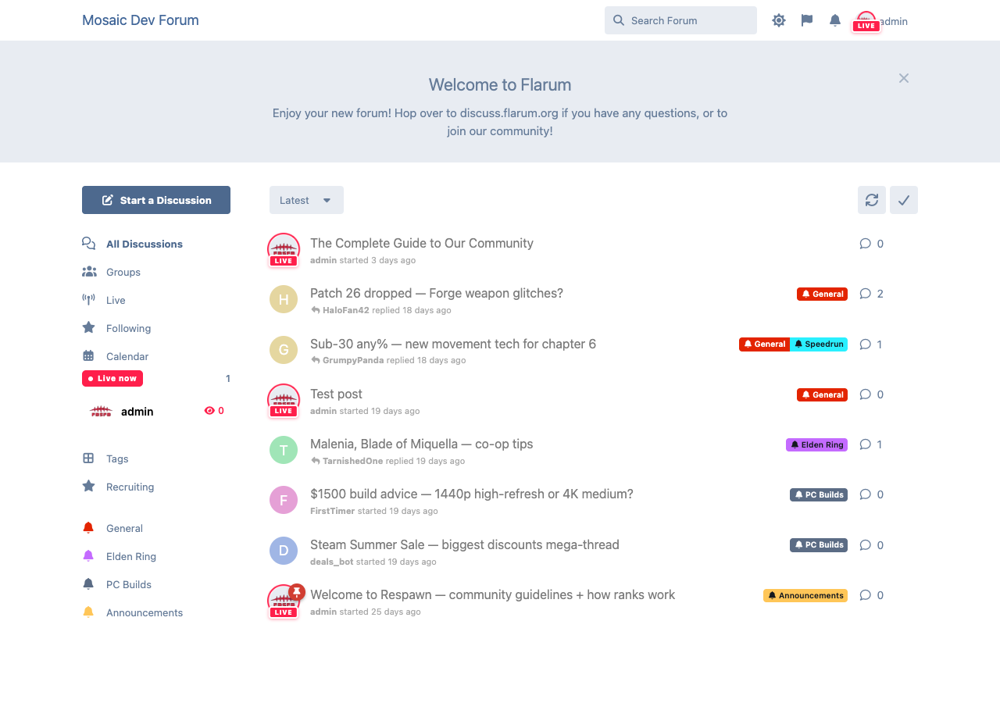
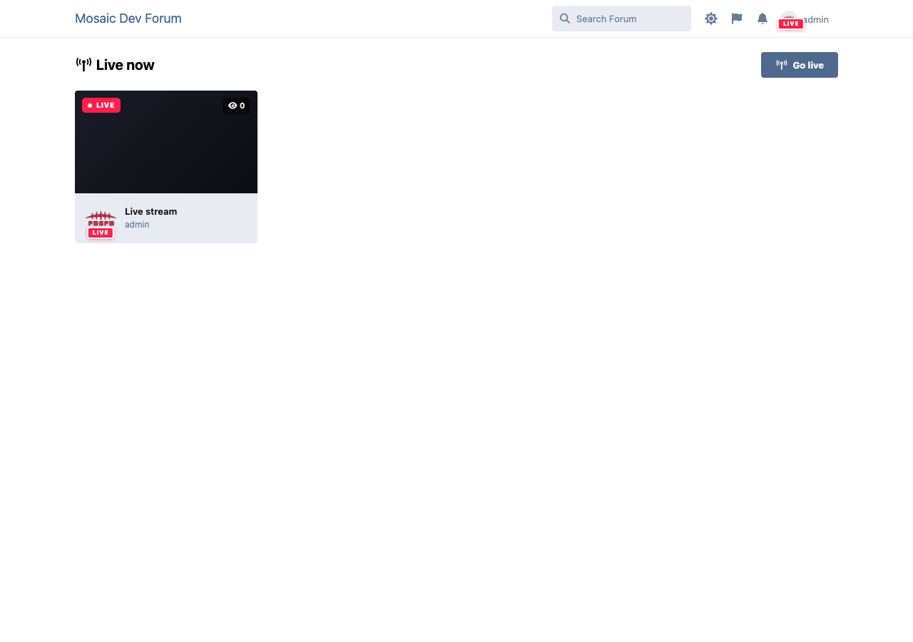
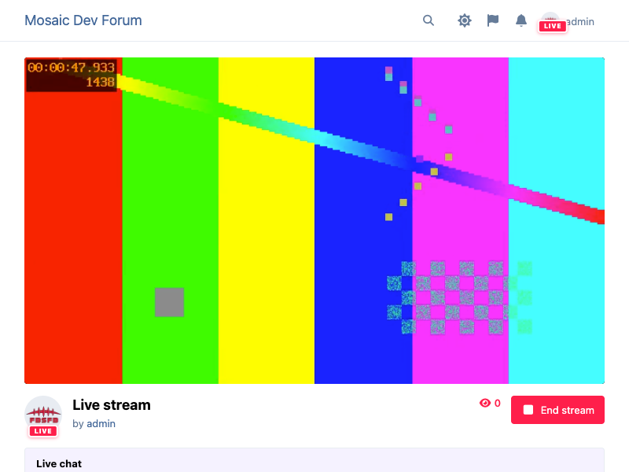
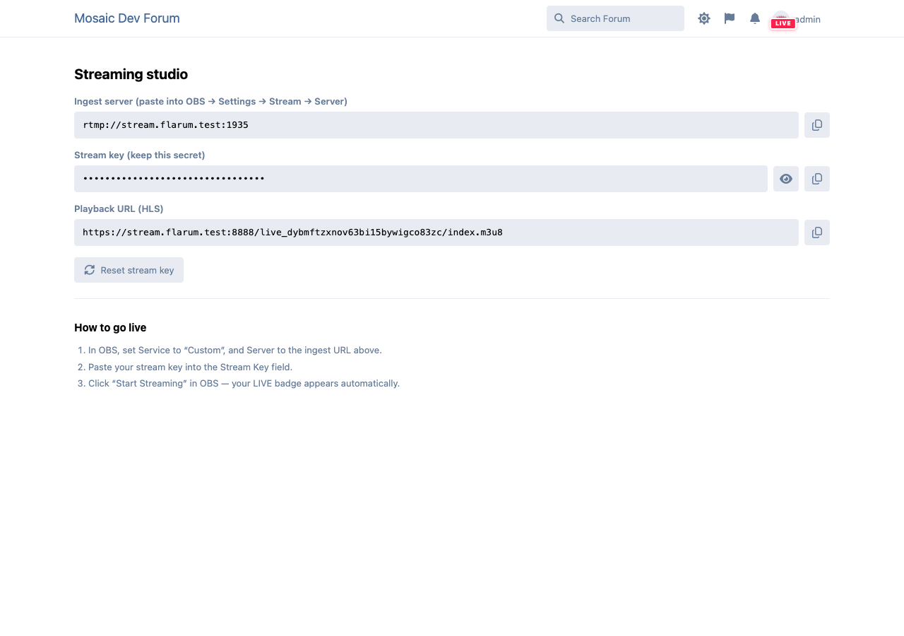

# OnAir — Live Streaming for Flarum 2

[](LICENSE)

Bring live video into your community. Members go live from **YouTube** or **Twitch**,
and a **LIVE NOW** badge follows their avatar everywhere it appears — posts, the
discussion list, mentions, the header, the sidebar.



> **Free / MIT.** The optional premium add-on **[OnAir+](https://github.com/ernestdefoe/onair-plus)**
> turns your forum into the whole platform — a built-in RTMP server (stream straight in
> from OBS), in‑forum HLS playback, multistream, VOD, live chat, go‑live notifications and
> scheduled streams. See the [comparison](#onair-vs-onair) below.

## Features

- 🔴 **LIVE badge on every avatar** — one `Avatar` override lights a streamer up everywhere.
- ▶️ **YouTube + Twitch embed viewer** — paste a channel/video URL and go live.
- 📡 **Presence with graceful fallback** — uses `flarum/realtime` for instant badge
  updates when installed, transparently falls back to lightweight polling when it isn't.
- 🟥 **Live Now widget + a `/onair` directory** — see who's streaming at a glance.
- 🔐 **Permissions + admin settings** — who can go live, default provider, poll interval.
- ⏱️ **Stale‑stream reaper** — auto‑ends streams left running.

### The Live directory



## OnAir vs OnAir+

OnAir (this extension) is free and complete on its own for YouTube/Twitch streamers.
**OnAir+** is a paid add‑on for communities that want to host streaming themselves.

| | **OnAir** (free) | **OnAir+** |
|---|:---:|:---:|
| LIVE badge on avatar, everywhere | ✅ | ✅ |
| Live Now widget + `/onair` directory | ✅ | ✅ |
| YouTube embed viewer | ✅ | ✅ |
| Twitch embed viewer | ✅ | ✅ |
| Realtime presence + polling fallback | ✅ | ✅ |
| Permissions + admin settings | ✅ | ✅ |
| Auto‑end stale streams | ✅ | ✅ |
| **Built‑in RTMP server → in‑forum HLS** | — | ✅ |
| **Stream keys + creator studio** | — | ✅ |
| **Multistream / restream to YouTube + Twitch** | — | ✅ |
| **VOD recordings** | — | ✅ |
| **Live chat overlay** | — | ✅ |
| **Go‑live notifications + follow a streamer** | — | ✅ |
| **Scheduled streams + reminders** | — | ✅ |
| **Concurrent viewer counts** | — | ✅ |

### OnAir+ — stream straight into the forum

Members broadcast from OBS to your own server; viewers watch an `hls.js` player inline,
with live chat beside it.



### OnAir+ — creator studio

Each streamer gets an ingest URL, a secret stream key, multistream targets, and a one‑click
key reset.



## Install

```bash
composer require ernestdefoe/onair
```

Then enable **OnAir** in the admin panel. Optionally install `flarum/realtime` for
instant (push) LIVE badges — OnAir detects it automatically. For self‑hosted streaming,
add **OnAir+** (`composer require ernestdefoe/onair-pro`).

## Development

```bash
cd js
npm install
npm run build      # or: npm run dev  (watch)
```

A no‑backend concept render of the whole product lives in [`preview/index.html`](preview/index.html).

## Architecture notes

- **LIVE badge:** overrides the shared `Avatar` component (main‑bundle, safe to extend at
  init) and reads a serializer‑supplied `user.isLive()`.
- **Presence transport:** `app.onair.presence` picks `RealtimeTransport` when
  `flarum/realtime` is detected, else `PollingTransport`; both expose the same API.
- **Providers:** `app.onair.providers` (JS) + the `StreamProvider` interface (PHP) are the
  extension points **OnAir+** plugs its RTMP/HLS provider into.

## License

MIT © Ernestdefoe
